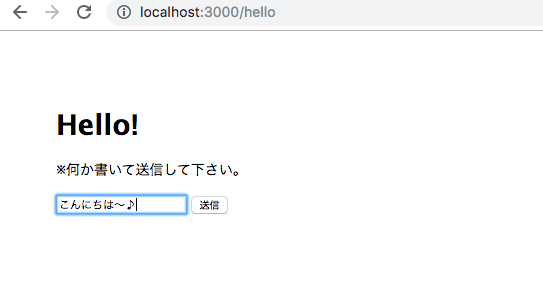
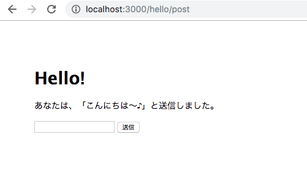
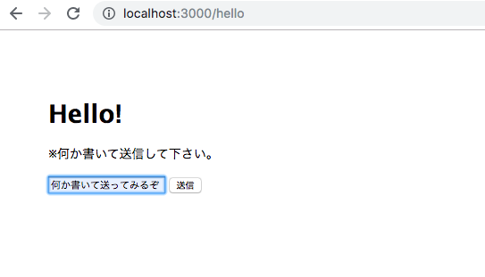
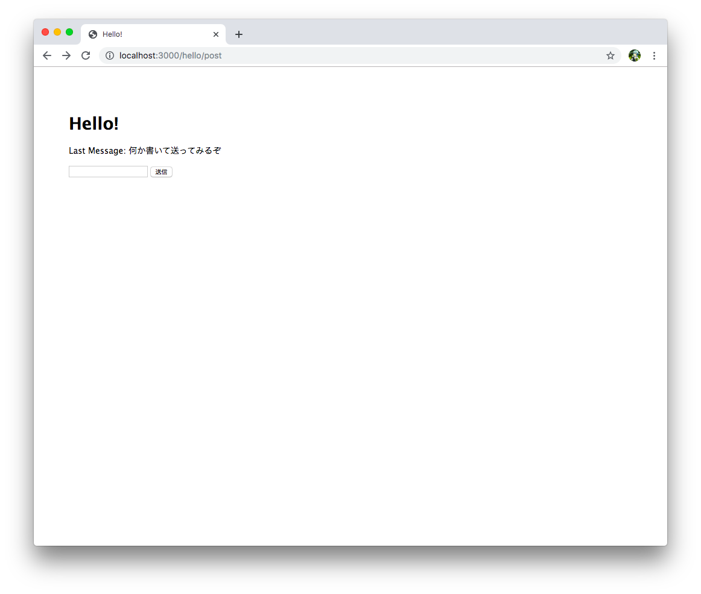
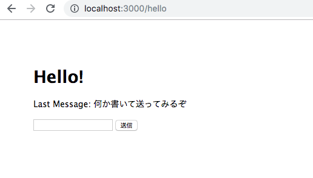

## Node.js 超入門
### 範囲:p245~p289
#### 宮﨑琉

---

## OUTLINE

- ### 5-1 パラメーターとフォーム送信
- ### 5-2 サーバーからのデータ取得
- ### 5-3 データベースを使おう!

---

## 5-1 パラメーターとフォーム送信

+++

パラメーターとフォーム送信については、Expressでの使い方と変わりません

+++?code=5-01.js
hello.js

@[5,6](queryからnameとmailの値を取り出す)

+++

+++

### フォーム送信について
Express Generatorで作成されたアプリでは、Body Parserが既に組み込まれている
+++?code=5-02.js
app.js

@[18,19](JSONエンコーディング、URLエンコーディング)

+++?code=5-03.ejs
hello.ejs

@[15](フォームの送信先を/hello/postに設置)
@[16](入力フィールドを用意)

+++?code=5-04.js
hello.js

@[12,13,14,15,16,17,18,19](フォーム送信した先の処理をrouter.postメソッドで用意)
@[13](bodyからPOST送信された値を取り出す)

+++

+++

+++

### セッションについて

- クライアントごとに値を保管するための仕組み
  - クッキーの機能とサーバー側のプログラム
- クライアントには、固有のセッションIDがクッキーに保存される |
- 各セッションIDごとに、サーバー側でデータを保管している |

+++

### セッションを利用する

- Express Sessionをインストールする

+++?code=5-05.js
app.js

@[6](express-sessionモジュールをロード)
@[24,25,26,27,28,29](セッションのオプション設定)
@[30](session関数を設定)

+++

- secret: 'keyboard cat'
  - 秘密キーとなるテキストで「ハッシュ」の計算に用いられる
- resave: false
  - セッションストアというところに強制的に値を保存する
- saveUninitialized: false
  - 初期化されていない値を強制的に保存する
- cookie: { maxAge: 60 \* 60 \* 1000 }
  - クッキーの保管時間を設定している

+++

### セッションに値を保存する

+++?code=5-06.js
hello.js

@[17,18](セッションは、sessionにmessageに値を保管している)
@[6,7,8](値がundefinedかチェックして、メッセージを作成している)

+++

+++

#### 時間が経過してから/helloにアクセスすると...

+++

+++

- セッションに保管された値は、それぞれのクライアントごとに分けられている
  - 自分の値の情報が漏れたり、他のクライアントの値を取り出せない

+++

### まとめ

- Body Parserを利用するためにapp.jsで行ったことは？
  - JSONエンコーディング、URLエンコーディング |
- セッションは何と何を組み合わせたもの？
  - クッキーの機能、サーバー側のプログラム |
- クッキーに保存されるものは？
  - セッションID |
- セッションを保管するためのプロパティは？
  - req.session |

---
