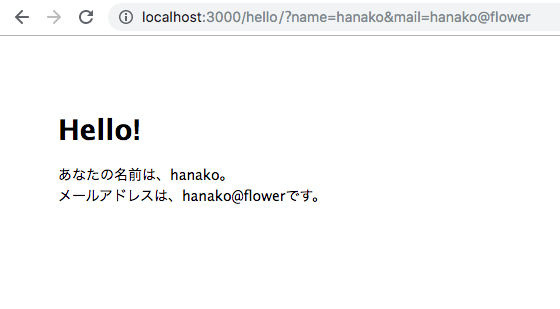

## Node.js 超入門
### 範囲:p245~p289
#### 宮﨑琉

---

## OUTLINE

- ### 5-1 パラメーターとフォーム送信
- ### 5-2 サーバーからのデータ取得
- ### 5-3 データベースを使おう!

---

## 5-1 パラメーターとフォーム送信

+++

``` javascript
var express = require('express');
var router = express.Router();

router.get('/',(req, res, next) => {
    var name = req.query.name;
    var mail = req.query.mail;
    var data = {
        title: 'Hello!',
        content: 'あなたの名前は、' + name + '。<br>' +
            'メールアドレスは、' + mail + 'です。'
    };
    res.render('hello', data);
});

module.exports = router;
```

+++?code=5-01.js

+++



+++
