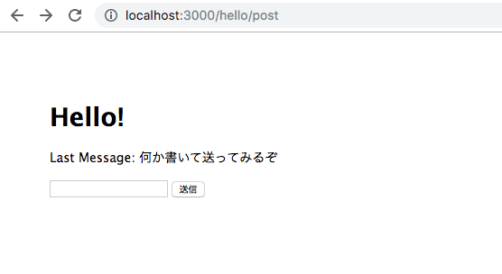

## Node.js 超入門
### 範囲:p245~p289
#### 宮﨑琉

---

## OUTLINE

- ### 5-1 パラメーターとフォーム送信
- ### 5-2 サーバーからのデータ取得
- ### 5-3 データベースを使おう!

---

## 5-1 パラメーターとフォーム送信

+++

パラメーターとフォーム送信については、Expressでの使い方と変わりません

+++?code=5-01.js
hello.js

@[5,6](queryからnameとmailの値を取り出す)

+++


+++

### フォーム送信について
Express Generatorで作成されたアプリでは、Body Parserが既に組み込まれている

+++?code=5-02.js
app.js

@[18,19](JSONエンコーディング、URLエンコーディング)

+++?code=5-03.ejs
hello.ejs

@[15](フォームの送信先を/hello/postに設置)
@[16](入力フィールドを用意)

+++?code=5-04.js
hello.js

@[12,13,14,15,16,17,18,19](フォーム送信した先の処理をrouter.postメソッドで用意)
@[13](bodyからPOST送信された値を取り出す)

+++


+++


+++

### セッションについて

- クライアントごとに値を保管するための仕組み
  - クッキーの機能とサーバー側のプログラム
- クライアントには、固有のセッションIDがクッキーに保存される
- 各セッションIDごとに、サーバー側でデータを保管している

+++

### セッションを利用する

Express Sessionをインストールする

+++?code=5-05.js
app.js

@[6](express-sessionモジュールをロード)
@[24,25,26,27,28,29](セッションのオプション設定)
@[30](session関数を設定)

+++

- secret: 'keyboard cat'
  - 秘密キーとなるテキストで「ハッシュ」の計算に用いられる |
- resave: false
  - セッションストアというところに強制的に値を保存する |
- saveUninitialized: false
  - 初期化されていない値を強制的に保存する |
- cookie: { maxAge: 60 \* 60 \* 1000 }
  - クッキーの保管時間を設定していて、最後のアクセスから設定した時間まではセッションが保たれる |

+++

### セッションに値を保存する

+++?code=5-06.js
hello.js

@[17,18](セッションは、sessionのmessageに値を保管している)
@[6,7,8](値がundefinedかチェックして、メッセージを作成している)

+++

+++


#### 時間が経過してから/helloにアクセスすると...

+++

#### 最後に送信したメッセージが保たれている

+++

### セッションに保管された値は

- 自分だけの値として、それぞれのクライアントごとに分けられている
- 自分の値の情報が漏れたり、他のクライアントの値を取り出せない

+++

### まとめ

- Body Parserを利用するためにapp.jsで行ったことは？
  - JSONエンコーディング、URLエンコーディング |
- セッションは何と何を組み合わせたもの？
  - クッキーの機能、サーバー側のプログラム |
- クッキーに保存されるものは？
  - セッションID |
- セッションを保管するためのプロパティは？
  - req.session |

---

## 5-2 サーバーからのデータ取得

+++

### ajaxとは

- JavaScriptでサーバーに非同期通信でアクセスし、必要なデータを取り出す技術
- ページ移動を行わず、その場でサーバーからデータだけを取り出せる
- データを取り出す場合は、クライアント側とサーバー側の両方で処理を用意する必要がある

+++

### ajaxの処理を用意する

+++?code=5-07.js
ajax.js

@[4,5,6,7,8](JSON形式のデータ)
@[10,11,12,13](クエリーパラメーターの値で、データを出力)

+++?code=5-08.js
app.js

@[11,24](ajax.jsをロードして、利用できる状態にしている)

+++

###  jQueryでAjaxを利用する

+++?code=5-09.ejs
hello.ejs

@[8](jQueryを利用できるようにしている)

+++

```javascript
$.getJSON("/ajax?id=" + n, function(json){・・・});
```
第１引数のアドレスにAjax通信し、第２引数でコールバック関数を実行する

コールバック関数の引数にあるjsonがJavaScriptオブジェクトになっていて、
そこから必要な値を取り出して利用する

+++

+++

+++

+++

### 最新版jQueryを使うには？

+++

jQueryをインストールして、「jquery.min.js」というスクリプトファイルを利用する
```javascript
<script src="/javascripts/jquery.min.js"></script>
```
このようなタグをEJSのテンプレートファイル内に用意すると、Webページから利用できる

+++

### Webサイトからデータを取得する
Ajaxでは自サイトでしかアクセスできないので、一般のWebサイトにアクセスしてデータを受け取ったりできない

+++

### サーバー側からなら外部サイトにアクセスしてデータを取り出すことができる
外部サイトからデータを取り出す場合は、利用の仕方も考えないといけない

+++

### データを配信しているサービスを利用する
- ニュースなどを提供するWebサイトでは、「RSS」を使って情報を公開している
  - RSSは、XMLを使ってデータを配信するフォーマット

+++

### RSSデータを利用するために用意すること
- 指定のWebサイトにアクセスしデータを取り出す機能
  - Expressに「HTTP、HTTPS」というモジュールがあるので利用する |
- XMLデータをパースしてJavaScriptのオブジェクトにする機能
  - 「XML2JS」というモジュールを利用する |

+++

### Googleのニュースを表示する

+++?code=5-11.ejs
hello.ejs

+++?code=5-12.js
hello.js

@[4,5](必要なモジュールのロード)
@[8,9,10,11,12](アクセスに関するオプション設定)
@[9](アクセスするホスト（ドメイン))
@[10](ポート番号)
@[11](パス(ドメイン以降の部分))
@[19,20,21,22,23,24,25](XMLのパース処理)
@[22](RSSのデータがまとめられている)

+++

+++

+++

#### Webサービスなどで配信される情報は、ほとんどがXMLかJSONなのでたいていの配信データは利用できるようになっている

+++

### まとめ

- Ajax通信は、同期か非同期か?
  - 非同期通信 |
- jQueryでAjax通信を行っていたメソッドは？
  - getJSON |
- RSSデータを利用するために必要なモジュールは？
  - 「HTTP、HTTPS」、「XML2JS」 |
- HTTPSのポート番号は？
  - 443番、HTTPは80番 |

---

## 5-3 データベースを使おう！

+++

### データベースとは

- サーバー側のプログラム内から、データベースサーバーにアクセスして利用する
  - クライアント＝サーバー＝データベース

+++

### サーバー型のSQLデータベースを使う

- データベースは、「SQL」というデータアクセス言語に対応しているものが多い
- Webをどこかで公開する場合、このタイプのデータベースを利用することが多い

+++

### MySQLを用意する

- MySQLは、オープンソースのデータベースプログラム
- XAMPPというMySQLが組み込まれたパッケージを利用する

+++

### XAMPPとは

- Web開発に必要な各種のプログラムを１つにまとめたもの
  - Webサーバー、Javaサーバー、データベースサーバー、ファイルサーバー、メールサーバー
- MariaDBという、MySQLのコンパチブルソフトがある
  - 開発元が違うだけで同じもの

+++

### MySQLを起動しよう！

XAMPPフォルダの「manager-osx」から起動させる

+++

「MySQL Database」、「Apache Web Server」


+++

### データベースを設計しよう

MySQLでデータベースを操作するための管理ツールを用いて作成する

+++

### データベースの構造

+++

- データベース
  - データを保管するおおもと |
- テーブル
  - 保管するデータの内容を定義したもの |
- フィールド
  - テーブルの詳しい１つ１つの値 |
- レコード
  - 実際に保存されるデータ |

+++

### まとめ

- 今回使用するデータベースは？
  - MySQL |
- MySQLが組み込まれたパッケージは？ |
  - XAMPP |
- 実際のデータを保管しているところは？
  - レコード |
